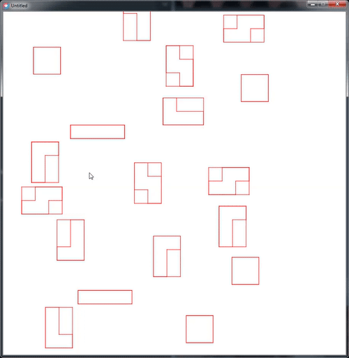

# Optimisation de découpe de forme

Nicolas Argyriou et Quentin Gliech

---

[](./img/svg.gif)

## LUA + Rust

Le programme est constitué de deux parties.
Une bibliothèque Rust comprenant le parser XML, le parser de chemin SVG, et l'extrapolation de ces chemins, et un programme LÖVE (Lua) pour charger les fichiers, afficher les formes et optimiser leur agencement.

Seules quelques fonctions sont exposées publiquement par la bibliothèque Rust, avec des structures simplifiées, ordonnées en mémoire de la même manière que des structures C.

```rust
#[repr(C)]
pub struct Drawing {
    size: u32,
    groups: *const Group,
}

#[repr(C)]
pub struct Group {
    // …
    size: u32,
    polygons: *const Polygon,
}

#[repr(C)]
pub struct Polygon {
    size: u32,
    vertices: *const Point,
}

#[repr(C)]
pub struct Point { /* … */ }

#[no_mangle]
pub extern "C" fn pretty_print(ptr: *const c_char) { /* … */ }

#[no_mangle]
pub extern "C" fn parse(ptr: *const c_char) -> Drawing { /* … */ }
```

donne en équivalent C

```c
typedef struct { /* … */ } Point;

typedef struct {
  uint32_t size;
  const Point *vertices;
} Polygon;

typedef struct {
  // …
  uint32_t size;
  const Polygon *polygons;
} Group;

typedef struct {
  uint32_t size;
  const Group *groups;
} Drawing;

Drawing parse(const char *ptr);

void pretty_print(const char *ptr);
```

Ces fonctions sont appelées ensuite par FFI (Foreign Function Interface) depuis le Lua. Les résultats sont ensuite manipulés comme des objets Lua classiques à quelques détails près.

## Partie Rust: Le Parser

Le parser (`src/parser.rs`) a été développé à partir d'une grammaire simplifiée d'XML trouvée ici: http://www.jelks.nu/XML/xmlebnf.html
La plupart de la grammaire a été implémentée, excepté tout ce qui concerne les définitions DTD.

Le parser XML peut être testé simplement en lançant `cargo run --example xml < fichier.xml` (sous réserve que Rust et Cargo soient installés sur la machine).

Un arbre de syntaxe est ainsi construit, pour être transformé en un arbre simplifié comprenant uniquement les chemins et les groupes SVG (`src/svg.rs`).

Les nœuds XML `path` contiennent un attribut `d`, décrivant le chemin à tracer.
Cet attribut est parsé (`srv/path.rs`), pour produire également un arbre de syntaxe, avec les différentes commandes (`MoveTo`, `LineTo`, `CurveTo`…).
Cet arbre peut être visualisé en lançant `cargo run --example svg < fichier.svg`.

Toutes les coordonnées sont à ce moment là normalisées pour indiquer uniquement des coordonnées absolues, en prenant en compte les éventuelles tranformations préalables.

### Construction des polygones

Une fois l'arbre de groupes et chemins SVG construit, il est récursivement simplifié, pour ne contenir plus qu'un seul niveau de groupes de polygones.

Les chemins sont dessinés pour devenir des groupes de polygones (un polygone étant une liste de points), et les groupes sont fusionnés pour ne devenir plus qu'une seule liste de polygones.

Après simplification, l'arbre devient donc une liste aplatie de groupement de polygones.

```rust
struct Root(Vec<Group>);
struct Group(Vec<Polygon>);
struct Polygon(Vec<Point>);
struct Point {
    x: f32,
    y: f32
};
```

### Exposition des résultats

Cette structure est ensuite adaptée pour devenir une structure C « standard », à base de tableaux de structures (pointeurs, avec leur taille), comme vu plus haut.

Au groupes sont ajoutés 4 propriétés désignant un rectangle de collision (x, y, hauteur, largeur), qui sera ensuite utilisé par l'algorithme pour détecter les collisions entre les formes.

## Partie Lua: L'agencement des formes

La partie lua utilise le moteur de jeu 2D "LÖVE" pour l'affichage graphique mais n'en fait l'usage que pour sa fonction `love.graphics.line(x1, y1, x2, y2)`. Nous avons également redéfini quelques fonctions de callback, `love.load()`, `love.draw()`, `love.update()` et `love.keypressed()` car c'est ainsi que fonctionne le moteur. 

Toute la partie affichage des formes et animations a donc été codée à la main, en objet. 

** Pourquoi pas GTK ? ** Nous avons fait ce choix car l'utilisation de GTK ou QT en lua est une route qui n'est pas encore bien pavée... et je doute que vous ayez envie de voir 800 lignes d'interactions avec des librairies graphiques, car il faut prendre en compte le cross-platform.

### Communiquer avec le parseur (parser.lua)

Le lua est le langage des API. L'appel des fonctions du parseur se fait donc très facilement. 

Nous donnons (sous forme de chaîne de caractère) des prototypes en langage C des structures et fonctions que nous souhaiterons appeler, et les fonctionnalités ffi nous renvoient des références vers des fonctions que nous pouvons appeler depuis le lua.

Sont donc chargées la fonction `void pretty_print(const char* input)` et la fonction `Drawing parse(const char* input)`. 

Un appel sur `parse` est fait pour chaque fichier SVG. Les données renvoyées sont des structures simples, ensuite transformées en objets `movable` définis dans `movable.lua`. 

Chaque forme contient un rectangle de pourtour définissant la collision ainsi qu'une suite de points avec lesquels nous créeons un polygone. 

Nos polygones ont un constructeur variadique (`Polygon:new(...)` dans polygon.lua). Chaque point est relié avec le suivant par une ligne droite, le dernier point est ensuite relié au premier. L'approximation des courbes de bézier est déjà faite par le parseur. 

### Les formes

Les prototypes de formes (rectangles, polygones, lignes, points) découlent du prototype "Shape" implémentant les fonctionnalités de base qu'une forme devrait avoir. Il n'existe pas de classes abstraites dans mon lua objet, mais c'en est une dans l'âme.

Une ligne est faite de points, un rectangle de lignes, etc, dans l'esprit des TDs.

Les formes destinées à être triées par l'algorithme (juste les rectangles) possèdent également une méthode `Collide` renvoyant false ou le nombre de formes actuellement en collision avec l'objet. 

### Les animations et le prototype 'movable'

Le prototype `movable` est censé se faire passer pour une forme, comme s'il implémentait `shape`. Il contient en réalité n'importe quelle forme, et rajoute les fonctionnalités de déplacement à celles-ci.

Les animations du projet reposent sur une fonction d'interpolation toute bête, `math.sin( t*(pi/2) )`, prenant un paramètre `t` entre 0 et 1. La fonction est bijective, et renvoie un nombre entre 0 et 1 également. L'interpolation est sinusoidale; lente au début, puis rapide, puis lente à nouveau sur la fin.

### Optimisation de l'espace (sorter.lua)

La méthode d'agencement des formes est bien visualisable sur [ce gif](./img/algorithm.gif). 

Notre projet contient deux arrangements de forme, `Sorter:sort()` et `Sorter:compact()`. 

#### Sort

`Sorter:sort` trie juste les formes de la plus petite aire à la plus grande comme beaucoup de projets le font. C'est le premier "rangement" que nous proposons, en o(log(n))

#### Compact

Ensuite, nous proposons `Sorter:compact`. C'est un algorithme que nous avons imaginé; il est censé être appliqué lorsque l'utilisateur a peu de temps devant lui. Il n'est pas parfait, mais il est rapide. o(n²) dans le pire des cas

L'algorithme tient un tableau des formes déjà triées. Il commence par trier les formes (quicksort) de la plus petite à la plus grande, puis il place la plus grosse, en (0,0) et l'ajoute dans son tableau. 

Il itère ensuite dans toutes les formes suivantes, qu'il tente de disposer à des endroits avantageux autour des formes déjà triées, en appliquant des 'stratégies de placement' triées de la stratégie la plus à la moins avantageuse (`findSpotAbove` la meilleure, puis `findSpotUnder`, et `findSpotNextTo` la moins bonne puisqu'elle élargit parfois le ruban).

Ces 'stratégies' sont des fonctions prenant en argument deux formes, l'une triée et l'autre à déplacer, qui renvoie un couple (x,y) donnant la nouvelle position de la seconde forme. 

L'algorithme essaye d'abord la première stratégie sur chaque forme déjà triée (son "voisin"), puis bascule sur la seconde stratégie si rien n'a été trouvé, puis la troisième, en s'arrêtant dès qu'une position acceptable est renvoyée.

Dans le cas de rectangles aléatoires, l'algorithme est rapide car beaucoup de "trous" existent où placer de petites formes entre les grosses. L'algorithme est en revanche le moins efficace sur les cas non-optimisables, comme celui de beaucoup de rectangles, tous de la hauteur du ruban, avec lesquels il atteint réellement sa complexité o(n²), puisqu'aucune stratégie de placement ne marche jamais.

Nous n'avons pas eu le temps d'implémenter d'algorithme "artillerie lourde" qui prendrait un temps variable et donnerait les résultats les plus compacts. 
